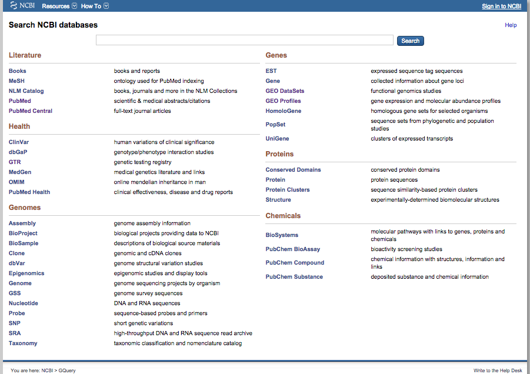
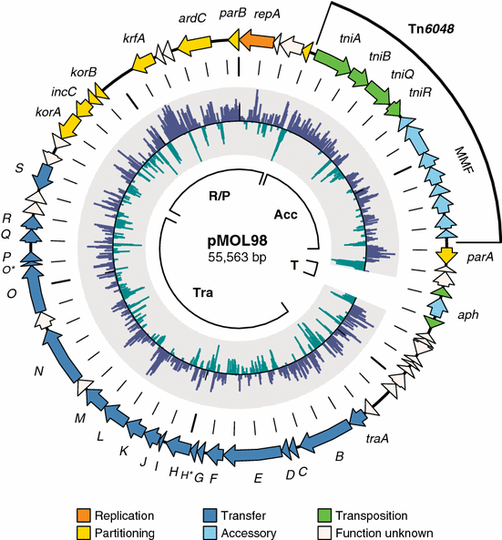
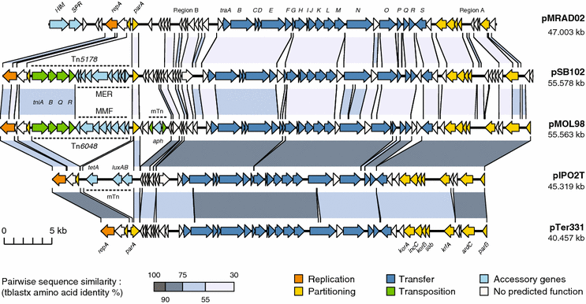
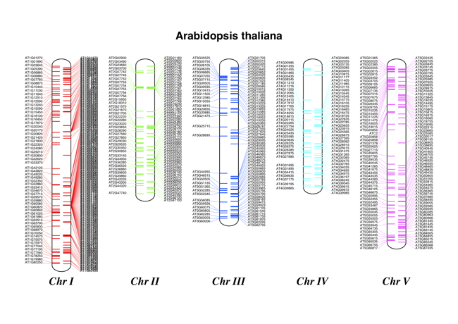

# URPP Tutorials
## URPP Evolution in Action


Stefan Wyder


# Introduction to Python

6 BioPython  
7 Regular expressions


## Download files
 
to be added


# 6. BioPython


chapters organized like in [BioPython tutorial](http://biopython.org/DIST/docs/tutorial/Tutorial.html)

1-4 Heidi

5  Sequence Input/Output  
6  Multiple Sequence Alignment objects  
7  BLAST  
9  Accessing NCBI's Entrez databases  
(Genbank, Medline, GEO, Unigene)  
10  Swiss-Prot and ExPASy  
16  Graphics including GenomeDiagram


## 6.5 Sequence Input/Output


The following chapter is a shortened (and a bit modified) version of [Peter Cock's workshop](
https://github.com/peterjc/biopython_workshop) on Biopython.
  
  
  
Dealing with assorted sequence file formats is one of the strengths of Biopython. The primary module we'll be using is `Bio.SeqIO`, which is short for sequence input/output (following the naming convention set by BioPerl's `SeqIO` module).

For these examples we're going to use files for the famous bacteria Escherichia coli K12 (from the NCBI FTP server).


### Counting records

We'll start by looking at the protein sequence in the FASTA amino acid file, NC_000913.faa. First take a quick peek using `head` to look at the start of the file (in the shell):

```
$ head NC_000913.faa
>gi|16127995|ref|NP_414542.1| thr operon leader peptide [Escherichia coli str. K-12 substr. MG1655]
MKRISTTITTTITITTGNGAG
>gi|16127996|ref|NP_414543.1| fused aspartokinase I and homoserine dehydrogenase I [Escherichia coli str. K-12 substr. MG1655]
MRVLKFGGTSVANAERFLRVADILESNARQGQVATVLSAPAKITNHLVAMIEKTISGQDALPNISDAERI
FAELLTGLAAAQPGFPLAQLKTFVDQEFAQIKHVLHGISLLGQCPDSINAALICRGEKMSIAIMAGVLEA
RGHNVTVIDPVEKLLAVGHYLESTVDIAESTRRIAASRIPADHMVLMAGFTAGNEKGELVVLGRNGSDYS
AAVLAACLRADCCEIWTDVDGVYTCDPRQVPDARLLKSMSYQEAMELSYFGAKVLHPRTITPIAQFQIPC
LIKNTGNPQAPGTLIGASRDEDELPVKGISNLNNMAMFSVSGPGMKGMVGMAARVFAAMSRARISVVLIT
QSSSEYSISFCVPQSDCVRAERAMQEEFYLELKEGLLEPLAVTERLAIISVVGDGMRTLRGISAKFFAAL
ARANINIVAIAQGSSERSISVVVNNDDATTGVRVTHQMLFNTDQVIEVFVIGVGGVGGALLEQLKRQQSW
```

Now let's count the records with Biopython using the `SeqIO.parse` function. Paste the following lines into a file `count_fasta.py`:

```python
from Bio import SeqIO
filename = "NC_000913.faa"
count = 0
for record in SeqIO.parse(filename, "fasta"):
    count = count + 1
print("There were " + str(count) + " records in file " + filename)
```

Have a look at the [SeqIO entry](http://biopython.org/wiki/SeqIO) in the Biopython wiki. As always you can also get help on the `SeqIO.parse` function using `help(SeqIO.parse)` or, in IPython, using `SeqIO.parse?`

### Looking at the records

In the above example, we used a for loop to count the records in a FASTA file, but didn't actually look at the information in the records. The `SeqIO.parse` function was creating [SeqRecord objects](http://biopython.org/wiki/SeqRecord). Biopython's `SeqRecord` objects are a container holding the sequence, and any annotation about it - most importantly the identifier.

For FASTA files, the record identifier is taken to be the first word on the > line - anything after a space is not part of the identifier.

This simple example prints out the record identifers and their lengths:

```python
from Bio import SeqIO
filename = "NC_000913.faa"
for record in SeqIO.parse(filename, "fasta"):
    print("Record " + record.id + ", length " + str(len(record.seq)))
```
Notice that given a `SeqRecord` object we access the identifer as `record.id` and the sequence object as `record.seq`. As a shortcut, `len(record)` gives the sequence length, `len(record.seq)`.


If you save that as `record_lengths.py` and run it you'll get over four thousand lines of output:

```
$ python record_lengths.py
Record gi|16127995|ref|NP_414542.1|, length 21
Record gi|16127996|ref|NP_414543.1|, length 820
Record gi|16127997|ref|NP_414544.1|, length 310
Record gi|16127998|ref|NP_414545.1|, length 428
...
Record gi|16132219|ref|NP_418819.1|, length 46
Record gi|16132220|ref|NP_418820.1|, length 228
```

#### Exercises
1. Count how many sequences are less than 100 amino acids long.
2. Write a script which only prints out 1 sequence provided as a command line argument.  
This is a frequent task.  
Tip: use `sys.argv` to get the sequence name.
3. (Optional) Plot a histogram of the sequence length distribution.  
For plotting you can use either Python's [`pylab` module](http://matplotlib.org/examples/index.html) or you save the result into a file and use R. 
4. (Advanced) Modify your script from (2.) so that it reads in a file containing sequences of interest (One sequence per line).

### Looking at the sequence 

The record identifiers are very important, but more important still is the sequence itself. In the `SeqRecord` objects the identifiers are stored as standard Python strings (e.g. `.id`). For the sequence, Biopython uses a string-like `Seq` object, accessed as `.seq`.

In many ways the Seq objects act like Python strings, you can print them, take their length using the `len()` function, and slice them with square brackets to get a sub-sequence or a single letter.


#### Checking proteins start with methionine

In the next example we'll check all the protein sequences start with a methionine (represented as the letter "M" in the standard IUPAC single letter amino acid code), and count how many records fail this. Let's create a script called `check_start_met.py`:

```python
from Bio import SeqIO
filename = "NC_000913.faa"
bad = 0
for record in SeqIO.parse(filename, "fasta"):
    if not record.seq.startswith("M"):
        bad = bad + 1
        print(record.id + " starts " + record.seq[0])
print("Found " + str(bad) + " records in " + filename + " which did not start with M")
```


If you run that, you should find this E. coli protein set all had leading methionines:

```
$ python check_start_met.py
Found 0 records in NC_000913.faa which did not start with M
```
Good - no strange proteins. This genome has been completely sequenced and a lot of work has been done on the annotation, so it is a 'Gold Standard'. Now try this on the potato protein file `PGSC_DM_v3.4_pep_representative.fasta`:

```
$ python check_start_met.py
PGSC0003DMP400032467 starts T
PGSC0003DMP400011427 starts Q
PGSC0003DMP400068739 starts E
...
PGSC0003DMP400011481 starts Y

Found 208 records in PGSC_DM_v3.4_pep_representative.fasta which did not start with M
```

#### Exercise
Modify this script to print out the description of the problem records, not just the identifier. Tip: Try reading the documentation, e.g. Biopython's wiki page on the [SeqRecord](http://biopython.org/wiki/SeqRecord).


### Different File Formats

So far we've only been using FASTA format files, which is why when we've called `SeqIO.parse()` the second argument has been `"fasta"`. The Biopython `SeqIO` module supports quite a few other important sequence file formats (see the table on the [SeqIO wiki page](http://biopython.org/wiki/SeqIO).

If you work with finished genomes, you'll often see nicely annotated files in the EMBL or GenBank format. Let's try this with the E. coli K12 GenBank file, NC_000913.gbk, based on the previous example:

```
>>> from Bio import SeqIO
>>> fasta_record = SeqIO.read("NC_000913.fna", "fasta")
>>> print(fasta_record.id + " length " + str(len(fasta_record)))
gi|556503834|ref|NC_000913.3| length 4641652
>>> genbank_record = SeqIO.read("NC_000913.gbk", "genbank")
>>> print(genbank_record.id + " length " + str(len(genbank_record)))
NC_000913.3 length 4641652
```

All we needed to change was the file format argument to the `SeqIO.read()` function - and we could load a GenBank file instead. You'll notice the GenBank version was given a shorter identifier, and took longer to load. The reason is that there is a lot more information present - most importantly lots of features (where each gene is and so on). We'll return to this in a later section, working with sequence features.

### Writing Sequences Files in Biopython

Now we'll focus on writing sequence files using the function `SeqIO.write()`.

#### Converting a sequence file

Recall we looked at the E. coli K12 chromosome as a FASTA file `NC_000913.fna` and as a GenBank file `NC_000913.gbk`. Suppose we only had the GenBank file, and wanted to turn it into a FASTA file?

Biopython's `SeqIO` module can read and write lots of sequence file formats:

```python
from Bio import SeqIO
input_filename = "NC_000913.gbk"
output_filename = "NC_000913_converted.fasta"
records_iterator = SeqIO.parse(input_filename, "gb")
count = SeqIO.write(records_iterator, output_filename, "fasta")
print(str(count) + " records converted")
```
Previously we'd always used the results from `SeqIO.parse()` in a for loop - but here the for loop happens inside the `SeqIO.write()` function.

Also have a look at the output file:
```
$ head NC_000913_converted.fasta
>NC_000913.3 Escherichia coli str. K-12 substr. MG1655, complete genome.
AGCTTTTCATTCTGACTGCAACGGGCAATATGTCTCTGTGTGGATTAAAAAAAGAGTGTC
TGATAGCAGCTTCTGAACTGGTTACCTGCCGTGAGTAAATTAAAATTTTATTGACTTAGG
TCACTAAATACTTTAACCAATATAGGCATAGCGCACAGACAGATAAAAATTACAGAGTAC
ACAACATCCATGAAACGCATTAGCACCACCATTACCACCACCATCACCATTACCACAGGT
AACGGTGCGGGCTGACGCGTACAGGAAACACAGAAAAAAGCCCGCACCTGACAGTGCGGG
CTTTTTTTTTCGACCAAAGGTAACGAGGTAACAACCATGCGAGTGTTGAAGTTCGGCGGT
ACATCAGTGGCAAATGCAGAACGTTTTCTGCGTGTTGCCGATATTCTGGAAAGCAATGCC
AGGCAGGGGCAGGTGGCCACCGTCCTCTCTGCCCCCGCCAAAATCACCAACCACCTGGTG
GCGATGATTGAAAAAACCATTAGCGGCCAGGATGCTTTACCCAATATCAGCGATGCCGAA
```

**Warning:** The output will over-write any pre-existing file of the same name.


There is also a handy helper function to convert a file:
```python
>>> from Bio import SeqIO
>>> help(SeqIO.convert)
```

The `SeqIO.convert()` function is effectively a shortcut combining `SeqIO.parse()` for input and `SeqIO.write()` for output.

`The SeqIO.write()` function is happy to be given multiple records like this, or simply as a list of `SeqRecord objects`. You can also give it just one record.

We'll be doing this in the next example, where we call `SeqIO.write()` several times in order to build up a mult-record output file.

#### Filtering a sequence file

The simplest solution is to open and close the file explicitly, using a file handle. The `SeqIO` functions are happy to work with either filenames (strings) or file handles, and this is a case where the more low-level handle is useful.

Here's a working version of the script, save this as `length_filter.py`:
```python
from Bio import SeqIO
input_filename = "NC_000913.faa"
output_filename = "NC_000913_long_only.faa"
count = 0
total = 0
output_handle = open(output_filename, "w")
for record in SeqIO.parse(input_filename, "fasta"):
    total = total + 1
    if 100 <= len(record):
        count = count + 1
        SeqIO.write(record, output_handle, "fasta")
output_handle.close()
print(str(count) + " records selected out of " + str(total))
```
This time we get the expected output - and it is much faster (needlessly creating and replacing several thousand small files is slow):
```
$ python length_filter.py
3720 records selected out of 4141
$ grep -c "^>" NC_000913_long_only.faa
3720
Yay!
```

#### Filtering by record name

A very common task is pulling out particular sequences from a large sequence file. Membership testing with Python lists (or sets) is one neat way to do this. Recap:

```
>>> wanted_ids = ["PGSC0003DMP400019313", "PGSC0003DMP400020381", "PGSC0003DMP400020972"]
>>> "PGSC0003DMP400067339" in wanted_ids
False
>>> "PGSC0003DMP400020972" in wanted_ids
True
```
**Exercise**   
Guided by the `filter_length.py` script, write a new script starting as follows which writes out the potato proteins on this list:

```python
from Bio import SeqIO
wanted_ids = ["PGSC0003DMP400019313", "PGSC0003DMP400020381", "PGSC0003DMP400020972"]
input_filename = "PGSC_DM_v3.4_pep_representative.fasta"
output_filename = "wanted_potato_proteins.fasta"
count = 0
total = 0
output_handle = open(output_filename, "w")
\# ...
\# Your code here
\# ...
output_handle.close()
print(str(count) + " records selected out of " + str(total))
```

The sample solution is called `filter_wanted_ids.py`, and the output should be:

```
$ python filter_wanted_id.py
3 records selected out of 39031
```

**Advanced Exercise:** Modify this to read the list of wanted identifiers from a plain text input file (one identifier per line).

**Discussion:** What happens if a wanted identifier is not in the input file? What happens if an identifer appears twice? What order is the output file?

### Working with Sequence Features

Read [this chapter](https://github.com/peterjc/biopython_workshop/blob/master/using_seqfeatures/README.rst) from Peter Cook's workshop.
  
  
There is much functionality of `SeqIO`, e.g. Biopython's `SeqIO.index(…)` function which lets us treat a sequence file like a Python dictionary. You can learn about them in the [Biopython Tutorial](http://biopython.org/DIST/docs/tutorial/Tutorial.html).


## 6.6. Multiple Alignments

`Bio.AlignIO` deals with files containing one or more sequence alignments represented as Alignment objects.

If you are interested in Multiple Alignments you can have a look at Peter's [workshop](https://github.com/peterjc/biopython_workshop/blob/master/reading_writing_alignments/README.rst)


## 6.7 Blast


BLAST can be run with BioPython either from using the command line tools -- provided they are installed -- or through the web. In this section, we use the qblast from the Bio.Blast.NCBIWWW module to call the online version of BLAST. Note that the results would be the same if we were to use the command line tools. As pointed out from the qblast documentation, there are three required arguments:

The first argument is the blast program to use for the search, as a lower case string. The options and descriptions of the programs are available at http://www.ncbi.nlm.nih.gov/BLAST/blast_program.shtml. Currently qblast only works with blastn, blastp, blastx, tblast and tblastx.
The second argument specifies the database in which to perform the search. Again, the options for this are available on the NCBI web pages at http://www.ncbi.nlm.nih.gov/BLAST/blast_databases.shtml.
The third argument is a string containing your query sequence. This can either be the sequence itself, the sequence in fasta format, or an identifier like a GI number.


The default output format for qblast is XML.


Web blast queries take relatively long.  Local BLAST allows you to search a custom database, or use a very large query. Installing ncbi-blast is straight-forward on Ubuntu:

```
sudo apt-get install ncbi-blast+
```
installs blastn, blastp, blastx,… in your path.

Blast binaries can be downloaded from [here](http://blast.ncbi.nlm.nih.gov/Blast.cgi?CMD=Web&PAGE_TYPE=BlastDocs&DOC_TYPE=Download).

## 6.8. NCBI's Entrez databases

### Overview databases



Entrez (http://www.ncbi.nlm.nih.gov/Entrez) is a data retrieval system that provides users access to NCBI’s databases such as PubMed, GenBank, GEO, and many others. You can access Entrez from a web browser to manually enter queries, or you can use Biopython’s Bio.Entrez module for programmatic access to Entrez. The latter allows you for example to search PubMed or download GenBank records from within a Python script.

The Bio.Entrez module makes use of the Entrez Programming Utilities (also known as EUtils), consisting of eight tools that are described in detail on NCBI’s page at http://www.ncbi.nlm.nih.gov/entrez/utils/. Each of these tools corresponds to one Python function in the Bio.Entrez module, as described in the sections below. This module makes sure that the correct URL is used for the queries, and that not more than one request is made every three seconds, as required by NCBI.

You can learn more in the [Biopython Tutorial](http://biopython.org/DIST/docs/tutorial/Tutorial.html).

## 6.9. Graphics

The `Bio.Graphics` module can plot chromosome and karyogram plots with annotations.  It can create PDF,EPS SVG output files as well as bitmap images (including JPEG, PNG, GIF, BMP and PICT formats).

**Examples**  

- Genome organization of a Bacterium [(publication)](doi:10.1007/s10482-009-9316-9)




- Locations of tRNA genes in the Arabidopsis*genome.



You can learn more in the [Biopython Tutorial](http://biopython.org/DIST/docs/tutorial/Tutorial.html).

# 7. Regular Expressions


check also http://www.dalkescientific.com/writings/NBN/

## Introduction

Regular expressions (aka regex or regexp or RE) is a tiny programming language to describe sets of strings, a sort of pattern.

A first example: count the number of fasta sequences in a file (fast & safe):
```
grep -c "^>" file.fa
```

Regular expressions often provide a safer (and faster) way of searching than a simple text search.


They can be used for several things:

- Powerful search and replace function
- Extract information
- Format checking


Here we practise regular expressions using python. We could also use the shell (grep/egrep, sed, awk), R, any other programming language and even many text editors and OpenOffice.

## Simple Patterns

The easiest regular expression is a literal string. For example, the regular expression `test` will match the string `test` exactly.


In python, we first have to load the built-in module `re`:  
```python
import re
```

The basic format is (query being a regular expression):
```python
Results = re.search(query, string)
```
  
```python  
re.sub("thaliana", "lyrata", MyString)
'Arabidopsis lyrata'
```

The same could have been achieved with the `replace()` function, as we did simple string replacement: `MyString.replace("thaliana", "lyrata")`.

  
Let's start with a simple example. We define a regular expression `MyRe` putting the letter r immediately before the opening quotation mark:
```python
MyRe = r"(\w)(\w+)"
```

The pattern `MyRe` captures 2 strings as indicated by the pair of brackets (1. the first letter, and 2. all the rest) counting from left to right.

Now we search our regular expression in the string `Arabidopsis thaliana`:
```python
MyString = "Arabidopsis thaliana"
MyResult = re.search(MyRe, MyString)
```
We could have done `MyResult = re.search(MyRe, "Arabidopsis thaliana")` directly which gives the same result.


```python
All matches together
MyResult.group(0)
'Arabidopsis'
```

Now we can get the first captured match (first pair of brackets)
```python
MyResult.group(1)
'A'
```

And the second captured match (second pair of brackets)
```python
The second captured match
MyResult.group(2)
'rabidopsis'
```


##Functions that use regular expressions

-------------------|----------------
Function | |    
re.sub(query, replacement, string) | Make *all* substitutions in a string  
search(query, string) | Extract some value  
re.search() | Detect the presence of a pattern
re.match() |  Like re.search but only if pattern matches the entire string
re.split() | Split a string according to a pattern


##Replacing text / Substitution

re.sub() is for replacing text. Its arguments are <pattern> (the regular expression), <repl(acement)> (the substitution pattern) and <string> (the string to work on).

The simplest regular expression pattern are just literal characters:

MyString = "23rd May 2000"
re.sub("May", "July", MyString)
[1] "23rd July 2014"


sub() replaces all occurences. Hence here we remove any space

re.sub(" ", "", " Hello World ")
'HelloWorld'

But we can replace a maximum number of occurences using  the `count` argument:
re.sub(" ", "", " Hello World ", 1)
'Hello World '

re.sub(" ", "", " Hello World ", 2)
'HelloWorld '

re.sub(" ", "", " Hello World ", 3)
'HelloWorld'


Regular expressions have much more abilities. Here we use a regular expression to only keep the 3 digits after the comma.

>>> re.sub(r"(\d+\.\d{3})\d+", r"\1", "34.73322532")
'34.733'

re.sub(r"(\d+)\w{2} (\w+) (\d+)", r"\2 \1 \3", "23rd May 2015")
'May 23 2015'


> regexp <- "([[:digit:]]{2}) ([[:alpha:]]+) ([[:digit:]]{4})"
> sub(pattern = regexp, replacement = "\\1", x = string)
<!---->\# returns the first part of the regular expression
[1] "23"
> sub(pattern = regexp, replacement = "\\2", x = string)
<!---->\# returns the second part
[1] "mai"
> sub(pattern = regexp, replacement = "\\3", x = string)
<!---->\# returns the third part
[1] "2000"

In the above simple example we could also use strsplit() to split the character vector into substrings separated by " ".
> strsplit(string, split=" ")
[[1]]
[1] "23" "mai" "2000"


##Escape special characters ‘$ * + . ? [ ] ^ { } | ( ) \

If you look for a meta-character ‘$ * + . ? [ ] ^ { } | ( ) \’, precede them with a backslash. As they have a double meaning we need '\' to interpret them as ordinary characters.

In Arabidopsis, isoforms of a gene X are called like X.1, X.2, X.3. Sometimes we need a list of genes which we can achieve using a regular expression. We have It even works with X.11 or X.100.


```python
> sub(pattern = "([^\\.]+)\\.[[:digit:]]", replacement = "\\1", x = "AT5G11100.3")
[1] "AT5G11100"
sub(pattern = "([^\\.]+)\\.[0123456789]", replacement = "\\1", x = "AT5G11100.3")
[1] "AT5G11100"
sub(pattern = "([A-z0-9]+).[0-9]", replacement = "\\1", x = "AT5G11100.3", perl=T)
[1] "AT5G11100"
```

There are often many different ways to write a working regular expression. With [] we can define our own character class. The ^ in square brackets means that it will match any character except the one written. Thus [^\\.] means any character but a dot. This way is a safe way to capture everything until the first dot.


##Finding text

grep() tells you whether a regular expression matches the input string x. If it matches it returns 1 and if it does not match integer(0).

grep(pattern = "21", x = "21 Aug 2014")
[1] 1
> grep(pattern = "\\d{2} \\w+ \\d{4}", x = "21 Aug 2014")
[1] 1
> grep(pattern = "\\d{2} \\w+ \\d{4}", x = "hello")
integer(0)

##Format Checking

Regular expressions are often used to check correct formatting. We want to check whether a string is correctly formatted doing grepl:

> grepl(pattern = "\\d{2} \\w+ \\d{4}", x = "21 Aug 2014")
[1] TRUE

or, alternatively, in a more expressive notation:
> grepl(pattern = "[[:digit:]]{2} [[:alpha:]]+ [[:digit:]]{4}", x = "21 Aug 2014")
[1] TRUE

The following one is false since there is only one digit in the first number in x:
> grepl(pattern = "\\d{2} \\w+ \\d{4}", x = "1 Aug 2014")
[1] FALSE

grepl tells us that the pattern/regexp is matching our string. Here we check a single string, but x could also be a vector containing many elements. grepl will return a logical vector telling us for each element of the vector whether it math


regexpr() and gregexpr() are more verbose versions of grep(). In addition to the position of the match (counting from left) they also return the length of the match. -1 is the result if the regexp does not match at all. Again, regexpr() only returns the first occurrence whereas gregexpr() returns all occurences.

> regexp <- "([[:digit:]]{2}) ([[:alpha:]]+) ([[:digit:]]{4})"
> string <- "blabla 23 mai 2000 blabla 18 mai 2004"
> regexpr(pattern = regexp, text = string)
[1] 8
attr(,"match.length")
[1] 11
attr(,"useBytes")
[1] TRUE
> gregexpr(pattern = regexp, text = string)
[[1]]
[1] 8 27
attr(,"match.length")
[1] 11 11
attr(,"useBytes")
[1] TRUE


##Splitting

s = "a 1 and 2 and 3 and 4"
a = re.split("\d", s) # every number is a delimiter
a
['a ', ' and ', ' and ', ' and ', '']


##Summary

- case-sensitive! (but see IGNORECASE flag)


## Application in Bioinformatics

Regular expressions are used a lot for data mangling (format conversion). Furthermore, regular expressions are often used for parsing, e.g. if you want to extract information from a BLAST report (e.g. the Sequence ID and the the E-value). Regular expressions can also be used to identify Sequence motifs (e.g. to search for a motif with 3 basic amino acids across 5 positions).

- protein domains
- DNA transcription factor binding motifs
- restriction enzyme cut sites
- degenerate PCR primer sites
- runs of mononucleotides
- read mapping locations

### Final Comment


Trial and error: Sometimes regular expressions do not behave as expected. In case of difficulties try to start simple, test parts of the regular expression and combine them once the subparts work. Often it also helps to do two rounds of replacements. Another level of complication is that there are 2 different types of regular expression, in R the default are 'extended regular expressions' (perl=FALSE) but there are also Perl-like regular expressions (perl=TRUE) that look different from the default type. It is easy to confuse them. Last, there unfortunately also differences between languages so that sometimes we have to find the correct version by trial and error.


##Exercise

1. Modify some of the input strings and patterns/regular expression and check whether they produce the expected results. You can e.g. add additional text to the input string or remove parts of the regexp.
2. Try out the 2 online tools (url given below). Choose the one that appeals most to you.
Develop a regexp to remove the noninformative parts of sample names: X20120401_Wyderrun31_1367.05.1_05.RCC
X20120401_Wyderrun31_1482.05.1_08.RCC

grep -v "^>" reference_transcriptome.fa | grep --color "[^AGCT]" | more

import re

\# This string contains HTML.
v = """<p id=x>Sometimes, <b>simpler</b> is better,
but <i>not</i> always.</p>"""

\# Replace HTML tags with an empty string.
result = re.sub("<.*?>", "", v)
print(result)


# Sources

- [Regular Expression HOWTO (Python doc)](https://docs.python.org/2/howto/regex.html#regex-howto)
- [Software Carpentry v4](http://software-carpentry.org/v4/regexp/index.html)
- [Haddock & Dunn. Practical Computing for Biologists. Sinauer Associates 2011.](http://practicalcomputing.org))
- [Python for Biologists](http://pythonforbiologists.com/index.php/introduction-to-python-for-biologists/regular-expressions/)

# Links

**Biopython**

[Short Tutorial (interactive notebook)](http://nbviewer.ipython.org/github/gditzler/bio-course-materials/blob/master/notebooks/BioPython-Tutorial.ipynb)

**Online tools to try regular expressions**  
- [http://regex101.com/](http://regex101.com/)   
- [http://www.regexr.com/](http://www.regexr.com/)   
- [https://www.debuggex.com/](https://www.debuggex.com/)  

**Cheat Sheets**  
- [CheatSheet from Practical Computing Biologists](http://practicalcomputing.org/files/PCfB_Appendices.pdf)

**Regular Expression in other languages**  
- [in R](http://en.wikibooks.org/wiki/R_Programming/Text_Processing#Functions_which_use_regular_expressions_in_R)  
- [using sed](http://www.grymoire.com/Unix/Sed.html#uh-4)

# ideas / to do

easy_install -f http://biopython.org/DIST/ biopython

http://www.drive5.com/muscle/downloads.htm


Bio.SeqIO wiki page (http://biopython.org/wiki/SeqIO)

The SeqIO.parse function was creating SeqRecord objects

Biopython's SeqRecord objects are a container holding the sequence, and any annotation about it - most importantly the identifier.

why file handles


\#or curl for Mac
wget ftp://ftp.ncbi.nlm.nih.gov/genomes/Bacteria/Escherichia_coli_K_12_substr__MG1655_uid57779/NC_000913.gbk
wget ftp://ftp.ncbi.nlm.nih.gov/genomes/Bacteria/Escherichia_coli_K_12_substr__MG1655_uid57779/NC_000913.fna
wget ftp://ftp.ncbi.nlm.nih.gov/genomes/Bacteria/Escherichia_coli_K_12_substr__MG1655_uid57779/NC_000913.ffn
wget ftp://ftp.ncbi.nlm.nih.gov/genomes/Bacteria/Escherichia_coli_K_12_substr__MG1655_uid57779/NC_000913.faa
http://potato.plantbiology.msu.edu/data/PGSC_DM_v3.4_pep_representative.fasta.zip


from http://fenyolab.org/presentations/Introduction_Biostatistics_Bioinformatics_2014/pdf/homework2.pdf
Bioinformatics data is heavy on strings (sequences) and various types of tab delimited tables,
as well as some key:value pairs such as GenBank records (field header: field contents). There
are also some complex data structures such as multiple alignments, phylogenetic trees, etc.
BioPython is a collection of Python modules that provide functions to deal with Bioinformatics
data types and functions for useful computing operations (reverse complement a DNA string,
find motifs in protein sequences, access web servers, etc.) as well as ‘wrappers’ that provide
interfaces to run other software (both via webservers and installed on your local computer) and
work with the output.
