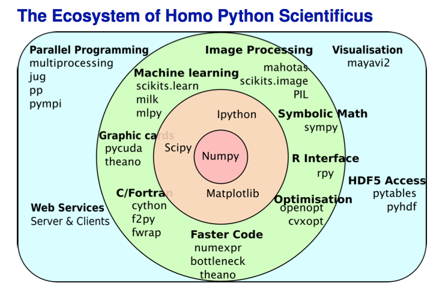

# URPP Tutorials
## URPP Evolution in Action

Stefan Wyder


## Introduction to Python

6. Functions
7. Libraries
8. Dictionaries

**Additional topics**  
9. Tuples  
10. Sets  
- [Repetition on Slicing](http://software-carpentry.org/v4/python/slice.html) (Access of lists, strings, tuples)
- Strings (Methods)


## 6. Functions

Functions are little stand-alone programs that are called from within your own program

We define new functions using `def`. Let's define a very simple function `SquareNumber` that returns the square of a number:

```python
def SquareNumber(Number):
    Squared = Number ** 2
    return Squared
```
  
To call a function, we just use the function's name, followed by the arguments in parentheses:  
`SquareNumber(4)` returns 16.  
  


In Python, the program can only "see" variables in the current frame and the base "global" frame.
If the current and global frames have variables with the same name, the one in the current frame takes precedence.
In other words, within a function you do not care 


```python
A function can have many `return`s
def sign(num):
    if num > 0:
	   return 1
	elif num == 0
	   return 0
	else:
	   return -1
```


Like variables, in Python functions don't have specific types.

```python
def double(x):
   return 2 * x
```   

```python
print double(2)
```
4

```python
print double('hello')
```
hellohello

In the first case, the function took an integer and returned an integer; in the second, it took a string and returned a string. Python's quite happy to do this...

### Default arguments

We can define default values. The function `adjust` has a required argument `value` and an optional argument `amount`: 
```python
def adjust(value, amount=2.0):
  return value * amount
```

If we call this function with one parameter, it is assigned to value, and 2.0 is used for amount
```python
print adjust(5)
```
10

If we call it with two parameters, the second overrides the default for amount.
```python
print adjust(5, 1.001)
```
5.005

### Why do we write functions

Which one do you prefer?
```python
for x in for range(1, GRID_WIDTH-1):
   for y in for range(1, GRID_HEIGHT-1):
     if (density[x-1][y] > density_threshold) or \\ if
        (density[x+1][y] > density_threshold):
        if (flow[x][y-1] < flow_threshold) or \\ if
           (flow[x][y+1] < flow_threshold):
           temp = (density[x-1][y] + density[x+1][y]) / 2
           if abs(temp - density[x][y]) > update_threshold: if
              density[x][y] = temp
```

Or this one?
```python
for x in for grid_interior(GRID_WIDTH):
   for y in for grid_interior(GRID_HEIGHT):
      if density_exceeds(density, x, y, density_threshold):
         if flow_exceeds(flow, x, y, flow_threshold):
            update_on_tolerance(density, x, y, tolerance)
```

Human short term memory can hold 7+-2 items. If somebody has to keep more than a dozen things in their mind at once to understand a block of code: break it into comprehensible pieces with functions.

- Make the code easier to read
- Avoid code duplication
- One task, one function
- Tell us what the function is doing, not how
- Functions should not be longer than 60-100 lines

Good programmers will write first the scaffold and only then the functions it implies


### Exercises

Now we want to define a more useful function which accepts lower and uppercase codons.


## 7. Libraries

Only the very basic Python functionality is available out of the box. For more specialized tasks,
we need to import additional functions bundled in **libraries** (aka modules or packages that are collections of modules).

There are thousands of libraries available for every imaginable task: web development, databases, game development,
image manipulation, system administration, ...

Some important libraries often used in scientific computing:



from [Christian Elsaesser](http://www.physik.uzh.ch/~python/python_2015-01/lecture4)
  
  
  
Library  | Description  
---------------- | -------------
math | Basic mathematical functions
os | Items related to the file system 
sys | System-level commands (sys.argv!)
random | Random sampling and numbers
NumPy | Multidimensional array, numerical computing, linear algebra
SciPy | Numerical integration & optimization
Matplotlib | plotting
pandas | Data structures & analysis (data frames!) 
IPython | Interactive Console
Biopython | Biological computation
Sympy | Symbolic mathematics


Particularly interesting for bioinformatics is **Biopython** which provides 
tools for computational molecular biology (sequence analysis, Alignment, BLAST, Phylogeny, Pubmed,...)

For R users: there is **pandas**, a rising star inspired by data.frames in R. 


### Loading modules

To use a module in a Python program it needs to be installed on the system and has to be imported. We will talk about module installation in a later paragraph.

A module is imported using the `import` statement. For example, to import the module math, which contains many standard mathematical functions, we do:
```python
import math
print math.log(40)
```
3.68887945411  
  
Note that we to call the function using the `ModuleName.FunctionName` syntax.


A more convenient way if we need only 1 function is 
```python
from math import log
print log(40)
```
3.68887945411
  
Note that we can call `log` directly.
  
  
We can also import a function under a different name (handy if two modules define functions with the same name)
```python
from math import log as ln
print ln(40)
```
3.68887945411


We can also use `import *` to bring everything in the module into the current namespace at once. This is almost always a bad idea.
If someone adds a new function or variable to the next version of the module, that `import *` could silently overwrite something that you're importing from somewhere else, leading to a hard-to-find bug.

```python
\#not good practice
from math import *
```

#### Command-line arguments

Copy the following lines and save them as `test_argv.py` using spyder.

```python
import sys
print sys.argv
```

Run the script with a command line argument, e.g. `python test_argv.py 4`. Run it also with multiple and without arguments.
Observe what is happening. 


\#CountLines.py
```python
import sys

def count_lines(reader):
   return len(reader.readlines())

if len(sys.argv) == 1:
   LineCount = count_lines(sys.stdin)
else:
   rd = open(sys.argv[1], 'r')
   LineCount = count_lines(rd)
   rd.close()

print LineCount
```

  

Every Python file can be used as a library by other programs


### Installing modules

With the exception of a few built-in modules (like os, sys, random) modules have to be installed on your system. 


pipy
easy_install
Linux package manager
Anaconda: conda


## 8. Dictionaries

- Dictionary (also known as associative array, hash or map) is another type of container
- Collection of names, or **keys**, with each key pointing to an associated **value**

- The keys for a dictionary must be unique
- Keys can be integers or strings ()
- Unordered: Elements don't have a fixed position

```python
PhoneNumbers = {}     				# Create an empty dictionary 
PhoneNumbers['John'] = ['463673']
PhoneNumbers['Mary'] = ['279943']
```

True to the dictionary analogy, values in dictionaies are looked up according to their keys, rather than by their position 
(as would happen in a list).


There are several ways to create dictionaries. The most direct way is like this:
```
MyDictionary = {key:value, nextkey:nextvalue}
```
For example
```python
PhoneNumbers = {'John':'463673', 'Mary':'279943'}
```

In this example, the keys are strings, and the values are strings.


We extract values from the dictionary using square brackets []
```python
print PhoneNumbers['Mary']
```
would print out Mary's phone number.


:bulb: Python does allow a statement to be split across lines if the splits occurs within (),[] or {}.
```python
PhoneNumbers = {
	'John':'463673',
	'Mary':'279943' }
```
is also valid, and often helps to make long list/dictionary entries more readible.


:bulb: The third way of creating is handy when you have 2 lists, one containing keys and the other containing values.
```python
Names = ['John','Mary']
Numbers = ['463673','279943']
PhoneNumbers = dict(zip(Names,Numbers))
```

If we are not sure whether a key is in a dictionary or not, we can test it:
```python
'Robbie' in PhoneNumbers
```
```html
   <style="color:blue"> False </style>
```
```python
'Mary' in PhoneNumbers
```
```html
   <style="color:blue">True</style>
```

Its often handy to combined dictionaries and lists, making a dictionary of lists. For instance, you could associate lists
of Blast hits with particular proteins.

```python
TreeStat = {}
TreeStat['Kodiak'] = [68, 57.8, -152.5]
TreeStat['Juneau'] = [73, 48.7, -134.2]
TreeStat['Barrow'] = [13, 52.5, -156.5]
```

More flexible than lists: In a dictionary, you can create an entry e.g. for key 16 without having any data corresponding to keys 0 to 15. This lets you fill in data as they become known.


### Exercise: Codon Table

We use Python's elegance for preparing a codon table:
```python
bases = ['t', 'c', 'a', 'g']
codons = [a+b+c for a in bases for b in bases for c in bases]
amino_acids = 'FFLLSSSSYY**CC*WLLLLPPPPHHQQRRRRIIIMTTTTNNKKSSRRVVVVAAAADDEEGGGG'
codon_table = dict(zip(codons, amino_acids))
```

Recode the above functionality in a less pythonic (more general) way using *for* loops


Now we have a dictionary codon_table containing the codon table, it will look up the amino acid
encoded by the codon. 

`print codon_table['atg']` will print out 'M'


### Exercise: Counting birds

```python
\# CountInsects.py
import sys

def count_names(lines):
  '''Count unique lines of text, returning dictionary.'''

  result = {}                   # Create an empty directionary to fill
  for name in lines:            # Handle input values one at a time
     name = name.strip()
     if name in result:     # If we have seen this name before...
            result[name] = result[name] + 1    # add one to its count
     else:                                      # If it is the first time we see that name
            result[name] = 1

  return result


reader = open(sys.argv[1], 'r')
lines = reader.readlines()
reader.close()
\# Count distinctive values
count = count_names(lines)
for name in count:
   print name, count[name]  
```

### Important dictionary functions

#### The .get() function

allows to extract values from a dictionary but with a default value to be returned if the entry doesn't exist.

```python
codon_table['atg']
codon_table.get('atg'])

codon_table.get('atg'], 0)
```

#### The .keys() function

Extracts a list of the keys in a dictionary. Remember that there is no intrinsic order to the keys or values in a dictionary.


#### The .values() function

Extracts a list of the values in a dictionary. Remember that there is no intrinsic order to the keys or values in a dictionary .


#### Listing keys and values

In Python pseudocode is similar to an if statement:

```
for MyItem in MyCollection:
   do a command with MyItem
   do another command
resume operation of main commands
```

You can loop through a dictionary using:

```python
for person in PhoneNumber:
    print person, PhoneNumber[person]
```
```
John 463673
Mary 279943
```

#### Sorting

The power of dict comes now from sorting: We can sort the keys and then retrieve the associated values in a particular order.


```python
SortedKeys = sorted(PhoneNumber.keys())
```

We can then loop over the sorted keys using:

```python
for PersonSorted in SortedKeys:
    print SortedPerson, PhoneNumber[PersonSorted]
```


Alternativey, we can sort the values and then retreive the associated keys:

```python
SortedValues = sorted(PhoneNumber.values())
```


## 9. Tuples

Watch the [video](http://software-carpentry.org/v4/python/tuples.html) on tuples from Software Carpentry. 

- A tuple is just an immutable list
- created with parentheses
```python
names = ('John', 'Mary')
```

## 10. Sets

- A **set** is an unordered collection of distinct values.
- Their elements can't be modified after being added
- fast data structure

Main functions |    |
---------------|-----
set.add('')    | Add element
set.remove('')    | Remove element
  
  
  

Methods | Operators
--------|-----------
set1.difference(set2) | set1 - set2
set1.intersection(set2) | set1 & set2
set1.issubset(setall) | set1 <= setall
 | set1 < setall
set1.issuperset(setall) | set1 >= setall
 | set1 > setall
set1.symmetric_difference(set2) | set1 ^ set2
set1.union(set2) | set1 \| setall

## Writing scripts

1. Write the simplest version of code
2. Refactor (remove duplication, reorganize the code)
3. If speed or memory are an issue: Optimize only at this point


Test with simple (simplified) made-up input file


## Sources

- [Software Carpentry v4](http://software-carpentry.org/v4/python/index.html)
- [Haddock & Dunn. Practical Computing for Biologists. Sinauer Associates 2011.](http://practicalcomputing.org))

- Quick Reference Sheet Python 2.7 (http://www.astro.up.pt/~sousasag/Python_For_Astronomers/Python_qr.pdf)

## Learning more Python

[Scientific Programming with Python: 4-day course @ UZH](http://www.physik.uzh.ch/~python/python_2015-01/programme.php)
programmingforbiologists.com


### Exercises

### 1. IDE

Open the script in Spyder
Run it
Which type has variable 'XXX'?
 
### 2. Functions

Write a function 


```python
def greet():
    return 'Good morning, master'
```

To call it, we just use the function's name, followed in this case by empty parentheses:
```python
temp = greet()
print temp
```
```html
   <span="color:red">Good morning, master</span>
```

### 3. Libraries

Import module sys and list the functions (methods) that are provided by it:

Then in Spyder type 'os.', then a window open showing you all the available 

- Try to find out which function to use to get the current working directory
- Try to find out which function to use to create a new directory


os.getcwd()
os.mk


### 4. Dictionaries