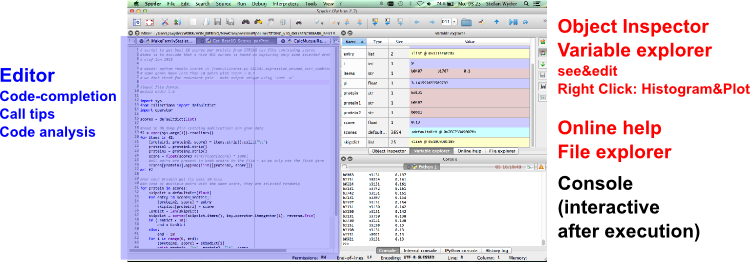

# URPP Tutorials
## URPP Evolution in Action


Stefan Wyder & Heidi Lischer


## Introduction to Python


1. Introduction (Why Python?)
2. Basics
3. Control Flow
4. Lists
5. Input and Output
6. [Functions](Python_Tutorial_SW.md) | [Solutions](Solutions_Python.md) 
7. [Libraries](Python_Tutorial_SW.md) | [Solutions](Solutions_Python.md) 
8. [Dictionaries](Python_Tutorial_SW.md) | [Solutions](Solutions_Python.md) 
9. [Tuples](Python_Tutorial_SW.md) | [Solutions](Solutions_Python.md) 
10. [Sets](Python_Tutorial_SW.md) | [Solutions](Solutions_Python.md) 


**Chapters 2-5 (Heidi)**   
[Theory](URPP_Tutorial_Python_HL.pdf) | [Exercises](Exercises_Python_Tutorial_HL.pdf) | [Data](Python_Data_HL.zip)

**Installation Instructions** and some **IPython Notebook examples** at the end of this document.


## 1. Introduction


### Some examples

[Nice Visualizations](http://www.randalolson.com/2014/06/28/how-to-make-beautiful-data-visualizations-in-python-with-matplotlib/)

The future of analysis notebooks: IPython Notebooks
Interactive Websites

http://localhost:8888/notebooks/anaconda/Examples/bokeh/charts/charts.ipynb#
http://localhost:8888/notebooks/anaconda/Examples/bokeh/plotting/notebook/color_scatterplot.ipynb#


### Why Python?

- clean & simple language  
  easy to read, fast & easy development
- expressive language  
  fewer lines, fewer bugs
- ease of manipulating text data
- popular in biology/bioinformatics/genomics
- (relatively) fast
- dynamic ecosystem
- used also in industry (Google, YouTube, NASA, ...)


### IDE (Integrated Development Environment)

Today we will be using [Spyder](https://github.com/spyder-ide/spyder).


Spyder is a MATLAB-like IDE for scientific computing with python. It has many nice features for code editing, interactive testing and debugging carried out in a single enviroment.




- Editor/Debugger: To show errors & warnings hover over warning triangles on the left of line numbers
- Interactive prompt: handy to test pieces of code
- Organize your scripts as projects (File | New Project...)


### Getting help

- the built-in help() function (e.g `help(round)`) and pydoc are often not very helpful
- use `object?` in the IPython console, e.g `floor?`
- use Google
- use https://docs.python.org/2/ 
- use dir() in the console
e.g. 
list available methods for a variable
```python
a = 'hello'
dir(a) 
```

it also works for modules, e.g. to list functions of a module do: 
```python
import sys
dir(sys)
```


## Sources

- [Software Carpentry v4](http://software-carpentry.org/v4/python/index.html)
- [Haddock & Dunn. Practical Computing for Biologists. Sinauer Associates 2011.](http://practicalcomputing.org)

- [Quick Reference Sheet Python 2.7](http://www.astro.up.pt/~sousasag/Python_For_Astronomers/Python_qr.pdf)


## Installation Instructions


For this course we will use Python v2.7. The latest version of Python (v3.0) has some real differences and is *not* compatible with versions < v3. Many people continue using v2.7 as the power of python comes from its packages and many of them are not yet available for Python v3.

If you will need Python v3 at a later stage you will learn it - the basic features we will be learning today are very similar.


Find out which version of Python your system has with 

```python
python --version
```

Your system should have a python version around 2.7 or 2.6. If the version number is 3.0 or more install a second version 
of python using Anaconda.

### Linux

Most Linux distributions come with python already installed. However, many packages are still missing:


- In Ubuntu Linux, to installing python and all the requirements run:
```
  $ sudo apt-get install python ipython ipython-notebook
  $ sudo apt-get install python-numpy python-scipy python-matplotlib python-sympy
  $ sudo apt-get install spyder
```
- In other Linux distributions, use your package manager to install python packages


If you have problems with installing some libraries consider [Anaconda Python v2.7](http://continuum.io/downloads)
Anaconda already comprises the most popular Python packages for science, math, engineering, data analysis.
With the Anaconda environment you also get [conda](http://conda.pydata.org/docs/) to install/manage different versions of libraries and modules. With Anaconda you can also have 2 or more different version of python simultaneously.

### Mac

Mac computers come preinstalled with the python interpreter. You can do all the exercises of today with what is preinstalled. However, the installation of some libraries is painful (e.g. to use IPython notebooks).

You have 3 options (If you dont know MacPorts and Fink, proceed with Solution #3 Anaconda)

- Using MacPorts:
  Use the following commands to install python and the packages that we need:
```
$ sudo port install py27-ipython +pyside+notebook+parallel+scientific
$ sudo port install py27-scipy py27-matplotlib py27-sympy
$ sudo port install py27-spyder
```
To associate the commands python and ipython with the versions installed via macports (instead of the one that is shipped with Mac OS X), run the following commands:
```
$ sudo port select python python27
$ sudo port select ipython ipython27
```

- Using Fink:
  Use the following commands to install python and the packages that we need:
```
$ sudo fink install python27 ipython-py27 numpy-py27 matplotlib-py27 scipy-py27 sympy-py27
$ sudo fink install spyder-mac-py27
```

- Anaconda
  Download [Anaconda Python v2.7](http://continuum.io/downloads). Anaconda already comprises the most popular Python packages for science, math, engineering, data analysis. With the Anaconda environment you also get [conda](http://conda.pydata.org/docs/) to install/manage different versions of libraries and modules. With Anaconda you can also have 2 or more different version of python simultaneously.

Use the 'launcher' in the folder 'anaconda' to launch Ipython, Notebooks or Spyder.   

### Windows

Windows lacks a good package manager. Download [Anaconda Python v2.7](http://continuum.io/downloads). Anaconda already comprises the most popular Python packages for science, math, engineering, data analysis. With the Anaconda environment you also get [conda](http://conda.pydata.org/docs/) to install/manage different versions of libraries and modules. With Anaconda you can also have 2 or more different version of python simultaneously.


## Installing modules

With the exception of a the built-in modules (like os, sys, random) third-party modules have to be installed on your system. 

The way how modules are installed depends on the operation system and for each operating system there are several options. Usually the best way is first to check the package manager of the system (homebrew/fink/MacPort for Mac computers, apt-get for Ubuntu Linux). Check also the [official documentation](https://docs.python.org/2/install/).

Alternatively, you can install [Anaconda Python v2.7](http://continuum.io/downloads)
Anaconda already comprises the 200 most popular Python packages for science, math, engineering, data analysis.

### Linux

Try first the package manager of your system, e.g. apt-get for Ubuntu. If the module can not be installed by the package manager try pip and/or easy_install.


### Mac computers

from http://docs.python-guide.org/en/latest/starting/install/osx/

Setuptools enables you to download and install any compliant Python software over a network (usually the Internet) with a single command (easy_install)

pip is a tool for easily installing and managing Python packages, that is recommended over easy_install. It is superior to easy_install in several ways, and is actively maintained.


## IPython Notebooks


- [IPython Interactive Demo](http://www.nature.com/news/ipython-interactive-demo-7.21492?article=1.16261) from Nature

- Locally, first start the notebook server by typing `ipython notebook`


**Some example code: an interactive slider**

IPythonNotebook_Slider.ipynb
```python
%matplotlib inline
 
import pylab as plt
import numpy as np
from IPython.html.widgets import interact
import math
 
def plot_sine(period=10):
    x = np.linspace(0,10,100)
    plt.plot(x,np.sin(x*2*math.pi/period))
 
interact(plot_sine,period=(2,20,.5))
```

#### More examples

[A gallery of interesting IPython Notebooks](https://github.com/ipython/ipython/wiki/A-gallery-of-interesting-IPython-Notebooks#general-python-programming)

More interesting IPython Notebooks:
- http://nbviewer.ipython.org/github/jrjohansson/scientific-python-lectures/blob/master/Lecture-1-Introduction-to-Python-Programming.ipynb
- https://plot.ly/python/heatmaps-contours-and-2dhistograms-tutorial/
- http://nbviewer.ipython.org/gist/jhemann/4569783
- http://nbviewer.ipython.org/gist/wesm/4757075/PandasTour.ipynb
- http://nbviewer.ipython.org/urls/bitbucket.org/hrojas/learn-pandas/raw/master/lessons/01%20-%20Lesson.ipynb
- http://nbviewer.ipython.org/gist/msund/7ac1203ded66fe8134cc
- http://nbviewer.ipython.org/urls/bitbucket.org/amjoconn/watpy-learning-to-code-with-python/raw/3441274a54c7ff6ff3e37285aafcbbd8cb4774f0/notebook/Learn%20to%20Code%20with%20Python.ipynb


### Some differences between R and python

Many participants know R, therefore I collected some differences between R and python. Beware, the list is not complete.


- In R, variable names can contain special characters "." and "_", whereas in python only "_" is allowed.

- In Python, an integer division will give an **integer** result
```
1.0 / 2 --> 0.5
1 / 2.0 --> 0.5
1 / 2 --> 0
``` 
To prevent unexpected results either make sure that at least one value is a real number using `float()` or, alternatively, put the following line at the beginning of your script
```python
from __future__ import division
```

- In python calculations / batch modification on a list do **not** work as in R, e.g. MyList = range(0,5); MyList * 2
To process the list element-by-element as in R, we need a `for` loop (or numpy).
```python
[Val**2 for Val in range(0, 10)]
Squares = [Val**2 for Val in MyList]
```

- Be careful when copying lists or dictionaries in python like NewDict = OldDict: its 'name copying'. See e.g. [video on aliasing](http://software-carpentry.org/v4/python/alias.html) 
